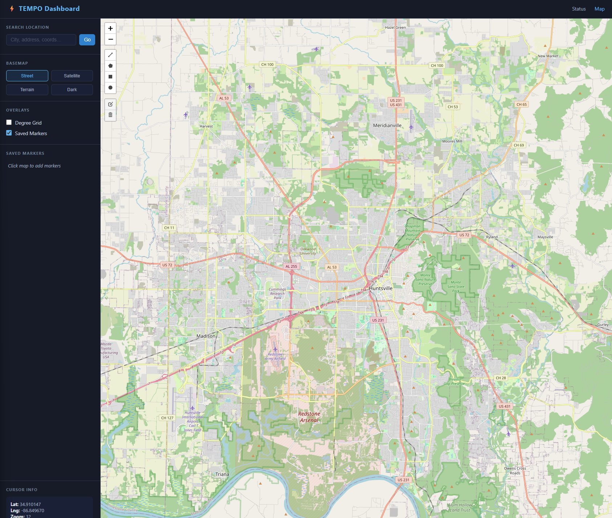

# TEMPO Dashboard

A Django-based geospatial dashboard for visualizing and interacting with TEMPO (Tropospheric Emissions: Monitoring of Pollution) data. The platform provides an interactive map interface, a REST API layer, and a foundation designed to be extended with real-time data ingestion, charting, and analysis tools.

---

## Table of Contents

1. [What This Project Is](#what-this-project-is)
2. [Tech Stack](#tech-stack)
3. [Prerequisites — Cold Start Checklist](#prerequisites--cold-start-checklist)
4. [Local Setup — Step by Step](#local-setup--step-by-step)
5. [Project Structure](#project-structure)
6. [Running the App](#running-the-app)
7. [Available Routes](#available-routes)
8. [Environment Variables](#environment-variables)
9. [Database](#database)
10. [Common Errors and Fixes](#common-errors-and-fixes)
11. [Git Workflow](#git-workflow)
12. [Deploying to Render](#deploying-to-render)
13. [Extending the Project](#extending-the-project)

---

---

## What This Project Is

TEMPO Dashboard is a Django web application with:

- A **status API** at `/` confirming the server is running
- An **interactive map** at `/map/` built with Leaflet.js — supports basemap switching (Street, Satellite, Terrain, Dark), click-to-place markers, geocode search, drawing tools, and a live coordinate display
- A **markers REST API** at `/api/markers/` for saving and retrieving pinned locations
- A **SQLite database** for local development, swappable to PostgreSQL for production
- A **Render-ready** deployment configuration via `Procfile` and `runtime.txt`

The project is intentionally minimal so it is easy to understand and extend. All the scaffolding is in place — the next developer picks up from a working foundation.

---

## Tech Stack

| Layer | Technology |
|---|---|
| Backend framework | Django 6.0 |
| Language | Python 3.12 |
| Frontend | Django Templates + Leaflet.js |
| Map library | Leaflet 1.9.4 (CDN, no build step required) |
| Database (local) | SQLite |
| Database (production) | PostgreSQL via `psycopg2-binary` |
| Static files | WhiteNoise |
| Production server | Gunicorn |
| Hosting | Render |

---

## Prerequisites — Cold Start Checklist

Complete every item here before touching any project code. This is a true cold-start list for a machine that has nothing installed.

### 1. Python 3.12

This project requires **Python 3.12 exactly** (specified in `runtime.txt`).

Check if you have it:
```bash
python --version
# or
python3 --version
```

If you don't have Python 3.12, download it from https://www.python.org/downloads/release/python-3123/ and install it. Make sure to check **"Add Python to PATH"** during the Windows installer.

After installing, confirm it works:
```bash
python3.12 --version
# Expected: Python 3.12.x
```

### 2. Git

Check if Git is installed:
```bash
git --version
```

If not, download from https://git-scm.com/downloads and install with default settings.

### 3. A terminal

- **Windows:** Use **PowerShell** or **Git Bash** (installed with Git). Do not use the old `cmd.exe`.
- **Mac/Linux:** Use the built-in Terminal app.

### 4. A code editor (recommended)

[VS Code](https://code.visualstudio.com/) is recommended. Install the **Python** extension by Microsoft once you open the project.

---

## Local Setup — Step by Step

Follow these steps in order. Do not skip steps.

### Step 1 — Clone the repository

```bash
git clone https://github.com/MayerT1/tempo_dashboard.git
cd tempo_dashboard
```

You are now inside the project root. All remaining commands run from this directory unless noted otherwise.

### Step 2 — Create a virtual environment

A virtual environment isolates this project's Python packages from everything else on your machine. You only do this once.

**Windows (PowerShell):**
```powershell
python -m venv venv
venv\Scripts\activate
```

**Mac / Linux:**
```bash
python3.12 -m venv venv
source venv/bin/activate
```

When the virtual environment is active, your terminal prompt will show `(venv)` at the start. **Every command from this point forward assumes the virtual environment is active.** If you close your terminal and come back later, you must re-run the activate command above before doing anything else.

To deactivate the virtual environment when you're done working:
```bash
deactivate
```

### Step 3 — Install dependencies

```bash
pip install -r requirements.txt
```

This installs Django, Gunicorn, WhiteNoise, psycopg2, and all other packages the project needs. It may take 30–60 seconds.

Verify the install worked:
```bash
python -m django --version
# Expected: 6.0.x
```

### Step 4 — Run database migrations

Django uses migrations to create and update database tables. Run this once on first setup, and again any time someone adds new migrations to the repo.

```bash
python manage.py migrate
```

Expected output — you should see a list of migrations each ending in `OK`:
```
Operations to perform:
  Apply all migrations: admin, auth, contenttypes, sessions
Running migrations:
  Applying contenttypes.0001_initial... OK
  Applying auth.0001_initial... OK
  ...
```

If you see `OK` for all items, the database is ready.

### Step 5 — (Optional) Create a superuser

If you want to access the Django admin panel at `/admin/`, create an admin account:

```bash
python manage.py createsuperuser
```

You'll be prompted for a username, email, and password. The email can be left blank. Use any password you like for local development.

### Step 6 — Start the development server

```bash
python manage.py runserver
```

Expected output:
```
Watching for file changes with StatReloader
Performing system checks...

System check identified no issues (0 silenced).
Django version 6.0.x, using settings 'config.settings'
Starting development server at http://127.0.0.1:8000/
Quit the server with CONTROL-C.
```

Open your browser and go to:

| URL | What you see |
|---|---|
| `http://127.0.0.1:8000/` | JSON status response |
| `http://127.0.0.1:8000/map/` | Interactive Leaflet map |
| `http://127.0.0.1:8000/admin/` | Django admin login |
| `http://127.0.0.1:8000/api/markers/` | Markers API (JSON) |

To stop the server press `CTRL + C`.

---

## Project Structure

```
tempo_dashboard/
│
├── config/                     # Django project configuration
│   ├── settings.py             # All settings: database, apps, static files
│   ├── urls.py                 # Root URL router — links to dashboard/urls.py
│   ├── wsgi.py                 # WSGI entry point (used by Gunicorn in production)
│   └── asgi.py                 # ASGI entry point (for future async support)
│
├── dashboard/                  # Main Django app — all feature code lives here
│   ├── migrations/             # Auto-generated database migration files
│   ├── templates/
│   │   └── dashboard/
│   │       └── map.html        # The full map page (Leaflet, sidebar, search)
│   ├── static/
│   │   └── dashboard/          # App-specific CSS and JS (if added)
│   ├── views.py                # Request handlers: home(), map_view(), map_markers_api()
│   ├── urls.py                 # URL patterns for this app: /, /map/, /api/markers/
│   ├── models.py               # Database models (currently empty — ready to extend)
│   ├── admin.py                # Registers models with Django admin
│   └── apps.py                 # App configuration
│
├── manage.py                   # Django CLI entry point — used for all dev commands
├── requirements.txt            # Python package dependencies (pinned versions)
├── Procfile                    # Render/Heroku process definition: web: gunicorn config.wsgi
├── runtime.txt                 # Specifies Python version for Render: python-3.12.3
└── db.sqlite3                  # Local SQLite database (auto-created, do not commit to prod)
```

---

## Running the App

### Start the server
```bash
python manage.py runserver
```

### Run on a different port (if 8000 is in use)
```bash
python manage.py runserver 8080
```

### Run accessible to other devices on your local network
```bash
python manage.py runserver 0.0.0.0:8000
```

### Check for configuration errors without starting the server
```bash
python manage.py check
```

### Create new migration files after editing `models.py`
```bash
python manage.py makemigrations
python manage.py migrate
```

---

## Available Routes

| Method | URL | Description |
|---|---|---|
| GET | `/` | Status check — returns JSON `{"status": "ok"}` |
| GET | `/map/` | Interactive map page |
| GET | `/api/markers/` | Returns all saved markers (session-scoped) |
| POST | `/api/markers/` | Save a new marker `{"lat": 0.0, "lng": 0.0, "label": "Name"}` |
| GET | `/admin/` | Django admin panel (requires superuser) |

---

## Environment Variables

For **local development**, no `.env` file is needed. The project runs with defaults in `config/settings.py`.

For **production on Render**, set these in the Render dashboard under Environment → Environment Variables:

| Variable | Value | Notes |
|---|---|---|
| `SECRET_KEY` | A long random string | Generate one at https://djecrety.ir/ |
| `DEBUG` | `False` | Never run `True` in production |
| `ALLOWED_HOSTS` | `your-app.onrender.com` | Your actual Render domain |
| `DATABASE_URL` | Set automatically by Render | Only needed if you add PostgreSQL |

To generate a secure secret key locally:
```bash
python -c "from django.core.management.utils import get_random_secret_key; print(get_random_secret_key())"
```

---

## Database

### Local development — SQLite

SQLite requires no setup. The file `db.sqlite3` is created automatically when you run `migrate`. It lives in the project root and stores everything locally. This is fine for development and testing.

### Production — PostgreSQL

When deploying to Render, add a **PostgreSQL** database service. Render will automatically inject a `DATABASE_URL` environment variable. The project already has `dj-database-url` and `psycopg2-binary` installed to handle this connection.

To wire it up, add this to the bottom of `config/settings.py`:

```python
import dj_database_url
import os

if not DEBUG:
    DATABASES['default'] = dj_database_url.config(
        conn_max_age=600,
        ssl_require=True,
    )
```

---

## Common Errors and Fixes

**`(venv)` is not showing in my prompt / commands not found**

Your virtual environment is not active. Run the activate command for your OS (see Step 2 above). You need to do this every time you open a new terminal window.

---

**`python` not found but `python3` works**

On Mac/Linux, use `python3` and `pip3` instead of `python` and `pip`. Or create an alias:
```bash
alias python=python3
```

---

**`ModuleNotFoundError: No module named 'django'`**

The virtual environment is not active, or you installed packages outside it. Activate the venv, then re-run `pip install -r requirements.txt`.

---

**Port 8000 already in use**

Another process is using port 8000. Either stop it or use a different port:
```bash
python manage.py runserver 8001
```

---

**`TemplateDoesNotExist: dashboard/map.html`**

The template directory is missing or `settings.py` doesn't point to it. Confirm the file exists:
```bash
ls dashboard/templates/dashboard/map.html
```
And confirm `config/settings.py` has this in the `TEMPLATES` setting:
```python
'DIRS': [BASE_DIR / 'dashboard' / 'templates'],
```

---

**`django.db.utils.OperationalError: no such table`**

You haven't run migrations yet, or new migrations were added. Run:
```bash
python manage.py migrate
```

---

**`Procfile.txt` instead of `Procfile`**

Windows sometimes adds `.txt` to files without extensions. The file must be named exactly `Procfile` with no extension. Check with:
```bash
ls -la Procfile
```

---

## Git Workflow

### First-time setup on a new machine
```bash
git clone https://github.com/MayerT1/tempo_dashboard.git
cd tempo_dashboard
# then follow Local Setup steps above
```

### Daily workflow
```bash
git pull                          # get latest changes
# make your edits
git add .
git commit -m "describe what you changed"
git push
```

### Creating a feature branch (recommended for larger changes)
```bash
git checkout -b feature/my-feature-name
# make changes
git add .
git commit -m "add my feature"
git push -u origin feature/my-feature-name
# then open a Pull Request on GitHub
```

---

## Deploying to Render

1. Push your code to GitHub.
2. Go to https://render.com and sign in.
3. Click **New → Web Service**.
4. Connect your GitHub account and select the `tempo_dashboard` repository.
5. Configure the service:
   - **Environment:** Python
   - **Build Command:** `pip install -r requirements.txt && python manage.py migrate && python manage.py collectstatic --no-input`
   - **Start Command:** `gunicorn config.wsgi`
6. Add Environment Variables (see [Environment Variables](#environment-variables) section above).
7. Click **Create Web Service**.

Render will build and deploy automatically. Every push to `main` triggers a new deploy.

Your app will be live at: `https://your-app-name.onrender.com`

---

## Extending the Project

The project is structured so that each new feature lives in `dashboard/` and is wired into the existing URL and template system. Here are the intended next steps:

**Add TEMPO data ingestion**
Create a management command in `dashboard/management/commands/` that fetches TEMPO API data and writes it to a new Django model.

**Visualize data on the map**
Add a new API endpoint that returns GeoJSON, then load it in `map.html` using `L.geoJSON()`.

**Add charts**
Install Plotly (`pip install plotly`) and add a `/charts/` view with a new template. Or use Chart.js from CDN in a template with no install required.

**Swap SQLite for PostgreSQL locally**
Install PostgreSQL, create a database, and update `DATABASES` in `settings.py` to use it. Use `dj-database-url` to parse the connection string.

**Add user authentication**
Django ships with a full auth system. Enable login/logout views in `config/urls.py` and protect views with `@login_required`.

**Add filtering and sorting to the API**
Extend `map_markers_api` in `views.py` to accept query parameters, or install `djangorestframework` for a full REST API with serializers.
